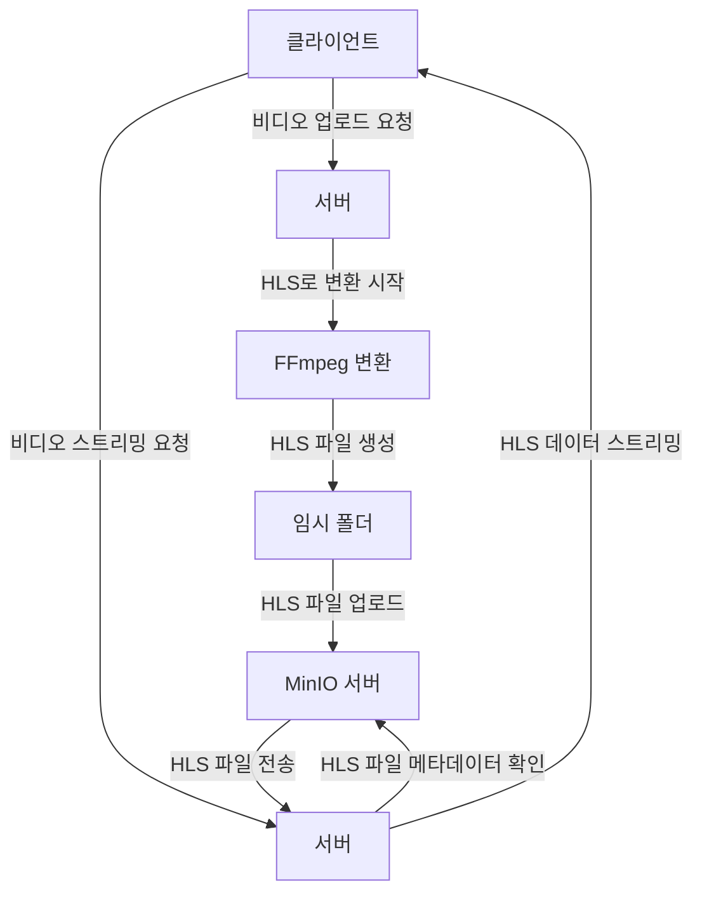

## 비디오 스트리밍 서버

이 프로젝트는 비디오 파일을 업로드하고 스트리밍하는 기능을 제공하는 서버 입니다.

### flow chart



1. **비디오 업로드 요청** :

- 클라이언트가 서버에 비디오 업로드 요청을 보냅니다.

- 서버는 비디오 파일을 MinIO 서버에 저장합니다.

2. **HLS 변환 및 파일 업로드** :

- 서버는 업로드된 비디오 파일을 FFmpeg를 사용하여 HLS 형식으로 변환합니다.

- 변환된 HLS 파일은 임시 폴더에 저장되며, 이후 MinIO 서버에 다시 업로드됩니다.

3. **비디오 스트리밍 요청** :

- 클라이언트가 HLS 파일 스트리밍을 요청합니다.

- 서버는 MinIO 서버에서 HLS 파일을 가져와 클라이언트로 스트리밍합니다.

### 주요 메서드 설명

1. **생성자 (constructor)**

- MinIO 클라이언트를 초기화합니다. envConfig에서 MinIO 설정을 가져와 클라이언트를 설정합니다.

2. **uploadVideo**

- 비디오 파일을 MinIO에 업로드하고, 업로드가 완료되면 HLS 형식으로 변환합니다.

- putObject 메서드를 사용하여 파일을 MinIO에 업로드합니다.

- 업로드 후 convertToHLS 메서드를 호출하여 HLS로 변환합니다.

3. **convertToHLS**

- MinIO에서 비디오 파일을 다운로드한 후, HLS 형식으로 변환합니다.

- ffmpeg 명령어를 사용하여 HLS 형식으로 변환합니다.

- 변환된 HLS 파일을 다시 MinIO에 업로드합니다.

- 변환 및 업로드가 완료되면 임시 파일을 삭제합니다.

4. **getHLSStream**

- 요청된 HLS 파일을 MinIO에서 스트리밍합니다.

- getObject 메서드를 사용하여 MinIO에서 HLS 파일을 가져옵니다.

### 프로젝트 실행 명령어

1. **환경 변수 설정** :

- `.env` 파일을 생성하고 필요한 환경 변수를 설정합니다. 예를 들어 MinIO 설정, 포트 번호 등을 설정합니다.

```base
NODE_ENV=development
PORT=3000
MINIO_ENDPOINT=minio
MINIO_PORT=9000
MINIO_ACCESS_KEY=MINIO_ACCESS_KEY
MINIO_SECRET_KEY=MINIO_SECRET_KEY
MINIO_BUCKET_NAME=videos

MINIO_ROOT_USER=minioadmin
MINIO_ROOT_PASSWORD=minioadmin
```

2. **Docker Compose 사용하여 실행** :

- Docker 및 Docker Compose를 사용하여 모든 서비스를 실행할 수 있습니다.

```sh
docker-compose up --build
```

3. **개발 환경에서 직접 실행** :

- Node.js 환경에서 직접 서버를 실행하려면, 다음 명령어를 사용합니다.

```sh
npm install
npm run build
npm start
```

4. **FFmpeg 설치** :

- FFmpeg가 설치되어 있어야 HLS 변환이 가능합니다. FFmpeg 설치 방법은 다음과 같습니다.

```sh
# Ubuntu
sudo apt-get update
sudo apt-get install ffmpeg

# MacOS
brew install ffmpeg
```

### 사용된 기술 및 스택

이 프로젝트에서 사용된 주요 기술과 스택은 다음과 같습니다:

- **Node.js**
- **Express**
- **MinIO**
- **Docker**
- **Docker Compose**
- **Multer**
- **Winston**

### 폴더 구조

```lua
.
├── Dockerfile
├── README.md
├── bun.lockb
├── docker-compose.yml
├── logs
│ ├── 2024-07-04.log
│ ├── error
│ │ └── 2024-07-04.error.log
│ └── warn
│ └── 2024-07-04.warn.log
├── package.json
├── public
│ └── index.html
├── src
│ ├── app.ts
│ ├── config
│ │ ├── envConfig.ts
│ │ └── loggerConfig.ts
│ ├── controllers
│ │ └── VideoController.ts
│ ├── routes
│ │ └── VideoRoutes.ts
│ ├── server.ts
│ └── services
│ └── VideoService.ts
└── tsconfig.json
```
